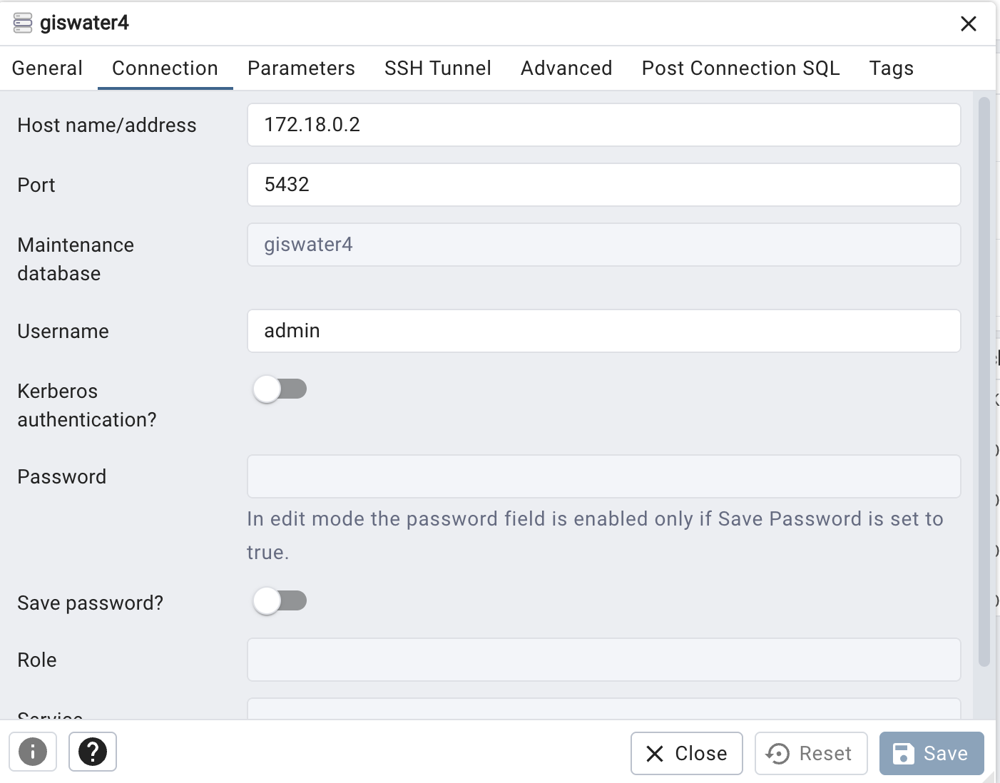
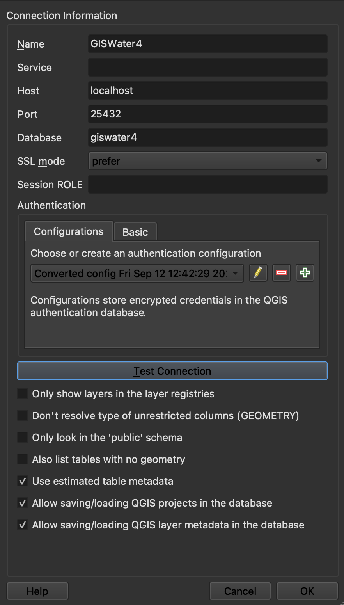

# Docker Compose for GISWater 4 

It actuality docker compose by configure for implement of GISWater 4.3 used [Kartoza Image](https://hub.docker.com/r/kartoza/postgis) 

It step next

1. Clone of repository

2. Copy variable file

```sh
cp .example.env .env
```

3. You can change variable in .env, for example user or password of pgadmin

4. Run docker compose

```sh
docker-compose up -d
```

5. Ready!!!


You can access to pgadmin on http://localhost:5050 and you can create to server connection, You must use the container's IP and port 5432. 


For Example of configuration connection 



You can see two db, giswater4 an project. First is for giswater4, it haved create extension of postgis, postgis_raster and pg_router. The second is for save the QGIS project. 

For configuration QGIS connection you must use the next configuration: 



Ready for use !!!
